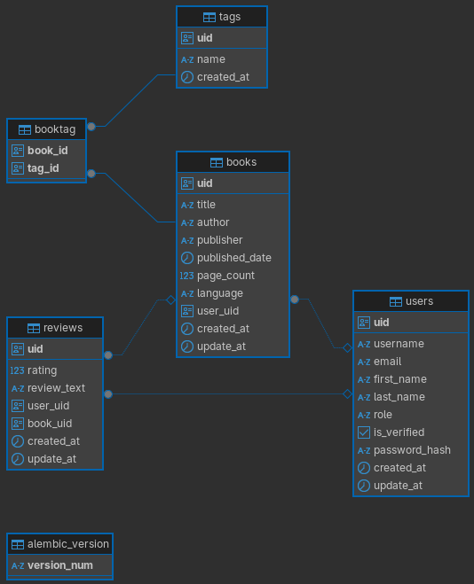

# FastAPI CrecereAI

## Getting Started
Follow the instructions below to set up and run your FastAPI project.

### Prerequisites
Ensure you have the following installed:

- Python >= 3.11
- PostgreSQL
- Redis

### Project Setup
1. Clone the project repository:
    ```bash
    git clone https://github.com/DyEsSuCr/crecereai-backend.git
    ```
   
2. Navigate to the project directory:
    ```bash
    cd crecereai-backend
    ```

# 🚀 Running the Application with Docker

Follow these steps to start the application and apply the necessary database migrations:

## 1. Start the containers

Run the following command to start all services defined in your `docker-compose.yml` file in detached mode:

```bash
docker compose up -d
```

## 2. Access the application container

Once the services are up and running, access the main application container (named `crecereai-backend-web` in this example):

```bash
docker exec -it crecereai-backend--web bash
```

This command opens a shell session inside the container, allowing you to run commands in the app environment.

## 3. Run database migrations

Inside the container, apply the latest Alembic migrations to ensure the database schema is up to date:

```bash
alembic upgrade head
```

This command updates the database to the most recent schema version defined in your Alembic migration files.

## API Endpoints

Once the application is running, you can access the API endpoints at `http://localhost:8000/api/v1/`. The application includes the following endpoint groups:

- **Books**: `http://localhost:8000/api/v1/books` - Manage book resources
- **Authentication**: `http://localhost:8000/api/v1/auth` - Handle user authentication
- **Reviews**: `http://localhost:8000/api/v1/reviews` - Manage book reviews
- **Tags**: `http://localhost:8000/api/v1/tags` - Handle book tagging functionality

### API Documentation

You can also access the interactive API documentation:
- **Swagger UI**: `http://localhost:8000/api/v1/docs`
- **ReDoc**: `http://localhost:8000/api/v1/redoc`

## Database Schema

The following Entity-Relationship diagram shows the database structure:

